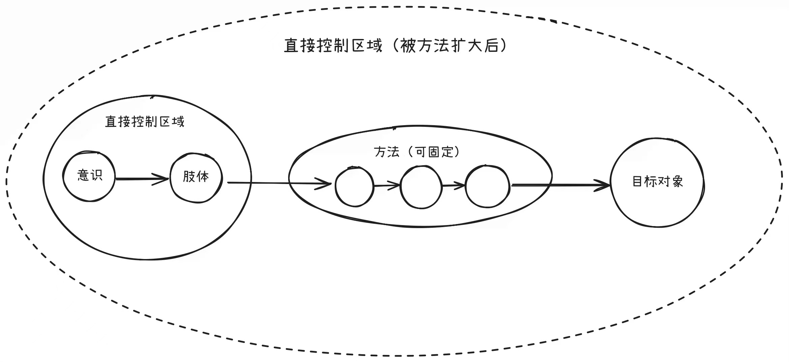

## 如何改造世界

图的解释：

- `认知之书`就是你边打这个游戏边习得的`攻略`
- `屏幕`后面是你的`主观世界`

## 方法论

### 事物的两面性

- 事物总是有和它`逻辑相反`的那一面存在

### 没有绝对的同一性

> [!TIP]
> 看似流水线装配矿泉水的瓶盖是完全使用一样的方法，实际上并不是完全一样，每瓶水在绝对的时间轴上出现的时间点不一样，导致机械臂必须在对应的时间点上落下。

### 重复则本质

- 重复则稳定, 稳定则本质

## 正确的知识

> 如果这个游戏一直打不顺利, 需要看看桌子上那本书是不是写错了

- 学习正确的`知识`, 则可以得到`想要`, 或者证明出`得不到想要`。
- 不学习正确`知识`，则总是难得到`想要`，总是反复碰壁。
