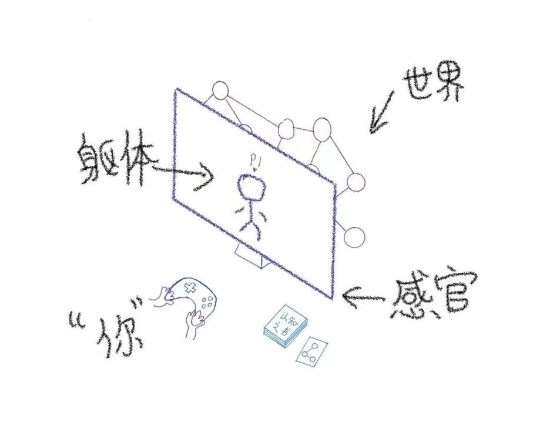

## 如何改造世界

图的解释：

- `认知之书`就是你边打这个游戏边习得的`攻略`
- `屏幕`后面是你的`主观世界`

## 正确的知识

> 如果这个游戏一直打不顺利, 需要看看桌子上那本书是不是写错了

- 学习正确的`知识`, 则可以得到`想要`, 或者证明出`得不到想要`。
- 不学习正确`知识`，则总是难得到`想要`，总是反复碰壁。

## 模拟与现实

- `模拟`是现实的`副本`
- 对`模拟`的修改不直接影响`现实`

## 解决问题

- `世界`是完全确定且完整细节的
- `状态`即`可修改的属性`
- `解决问题`即`修改已确定属性`
