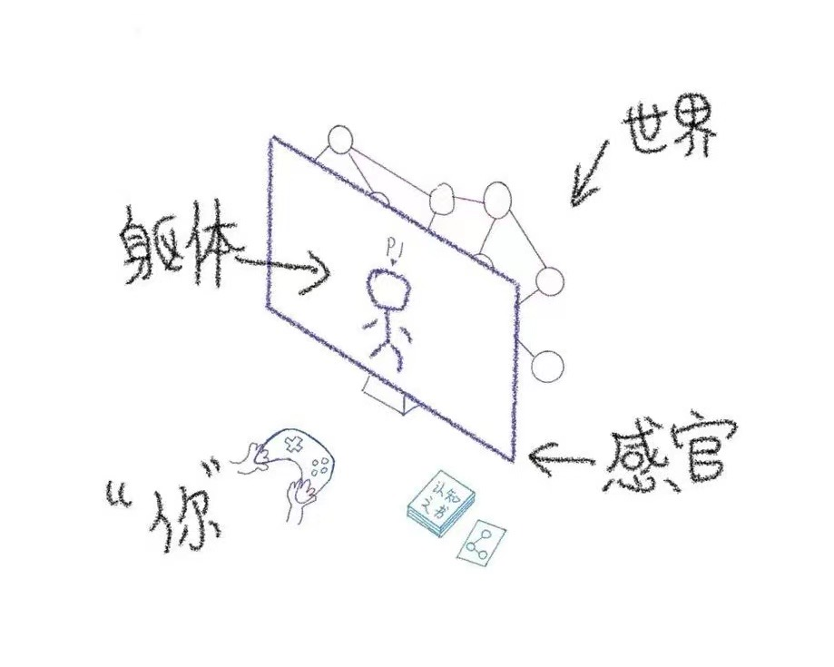
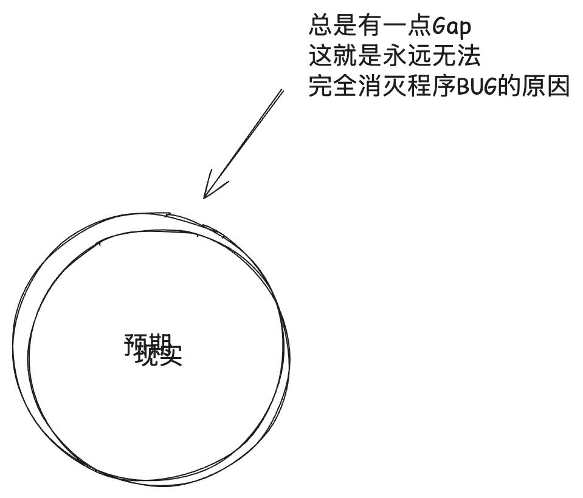

## 如何改造世界

图的解释：

- `认知之书`就是你边打这个游戏边习得的`攻略`
- `屏幕`后面是你的`主观世界`

## 正确的知识

> 如果这个游戏一直打不顺利, 需要看看桌子上那本书是不是写错了

- 学习正确的`知识`, 则可以得到`想要`, 或者证明出`得不到想要`。
- 不学习正确`知识`，则总是难得到`想要`，总是反复碰壁。

## 永远的BUG

- 这两个圈圈，重合几乎不可能，而不重合则非常容易
- 要写出健壮的几乎不出问题的完美程序, 转变态度尽力去贴近客观现实
- 你推理不出必然没有bug，那就努力去减少`BUG`

> [!IMPORTANT]
> 注意极小的偏差有可能会被机制放大，举个例子如果你负责维护支付系统，则严谨程度要求极高，不然可能损失亿万。

> [!IMPORTANT]
> 反直觉的真理：你的所有判断一定是错的，只是错的程度的大小。

## 模拟与现实

- `模拟`是现实的`副本`
- 对`模拟`的修改不直接影响`现实`

## 解决问题

- `解决问题`即`修改变量值为指定的值`

## 自动化本质

- 自动化的本质：解决问题的依赖条件里不包含人的身心活动
- 自动化的推论：因此能低成本从解决一个问题变成解决一类问题

> 自己干活的局限性：必须干指定的事情，从而自己的需求无法被满足。
> 我们定义它为“抑制需求“，“抑制需求“的程度通常是（抑制时间）

### 组合性

以下两个性质是`计算机编程`与`物理造物`的本质区别：

- 多样性：被组合物的多样性、易获取性
- 自动化：组合之后`计算`的不依赖身心活动

> [!TIP]
> 被组合物，类似于 `npm库中的组件`、`逻辑单元`等

> [!TIP]
> 组合本质上就是逻辑表达式的连接

## 全局最优

- 全局最优即问题最少的状态
- 若子问题之间无矛盾，则每个子问题都必须解决
- 若子问题之间有矛盾，则权衡到问题最少，若有其他路径可以超越则使用问题更少的路径

## 万物皆 Agent

万物皆智能体、智能体即规则、规则即逻辑