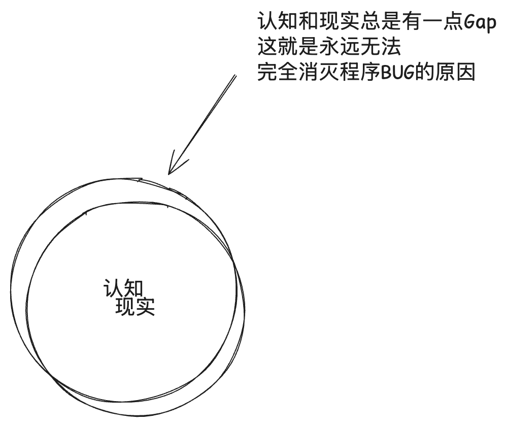

## 如何改造世界

图的解释：

- `认知之书`就是你边打这个游戏边习得的`攻略`
- `屏幕`后面是你的`主观世界`

## 正确的知识

> 如果这个游戏一直打不顺利, 需要看看桌子上那本书是不是写错了

- 学习正确的`知识`, 则可以得到`想要`, 或者证明出`得不到想要`。
- 不学习正确`知识`，则总是难得到`想要`，总是反复碰壁。

## 永远的BUG

- 这两个圈圈，重合几乎不可能，而不重合则非常容易
- 要写出健壮的几乎不出问题的完美程序, 转变态度尽力去贴近客观现实

> [!IMPORTANT]
> 注意极小的偏差有可能会被机制放大，举个例子如果你负责维护支付系统，则严谨程度要求极高，不然可能损失亿万。

> [!IMPORTANT]
> 反直觉的真理：你的所有判断一定是错的，只是错的程度的大小。

## 模拟与现实

- `模拟`是现实的`副本`
- 对`模拟`的修改不直接影响`现实`

## 解决问题

- `解决问题`即`修改变量值为指定的值`

## 自动化本质

花别人的精力，自己付出0的精力（思维活动+肢体运动），做成一件事

> 招募你的`机器员工`

> 精力就是解决问题的力量，可被消耗