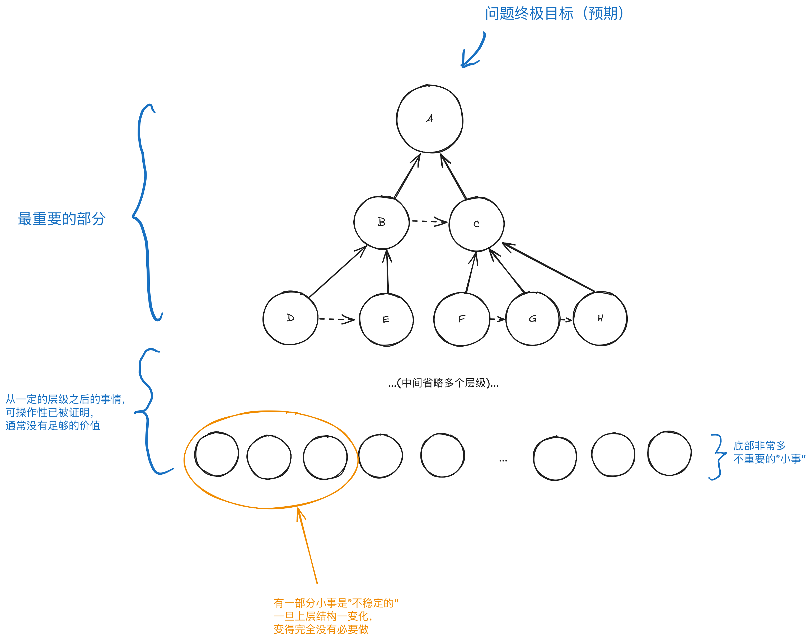

## 问题

- `问题`就是`预期`和`现状`的差距
- `问题被解决`就是`现状`已经变成`预期`

> [!TIP]
> 问题的分解，可以看作内涵集合的划分。引用：[分析和综合](./分析和综合.md)

## 分解问题

- `分解问题`就是找到：`哪几个问题解决了, 这个问题就已经解决了`
- `分解问题`需要`知识`

### 由于树的性质：

- `分解问题`通常只有前几层是`主要价值`所在
- `分解问题`通常只需要几步就能解决问题
- 最后几层的`小事`会非常多, 部分`小事`是不稳定的, 且价值较低

### 图示：

- 图中每一个节点都是一个`目标`或`预期`
- 图中的`虚线箭头`代表前者是后者的`条件`

### 扩展阅读:

- [目标的合并](./目标的合并.md)