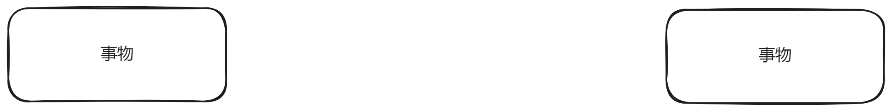
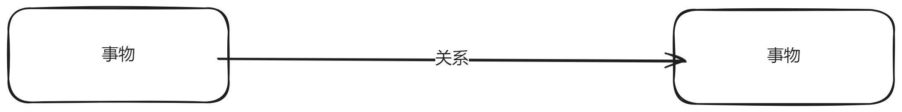
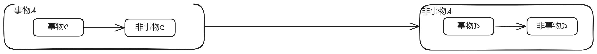
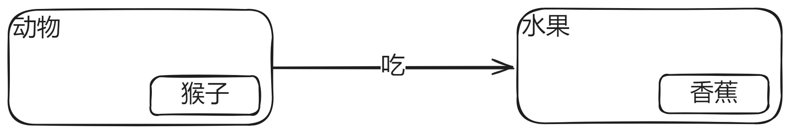
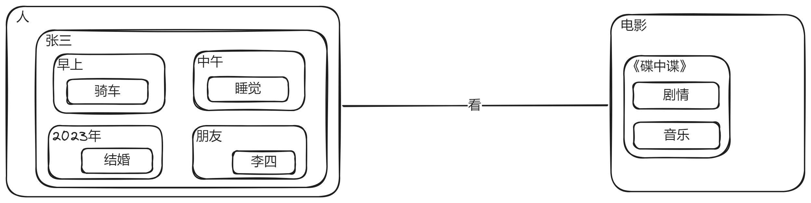
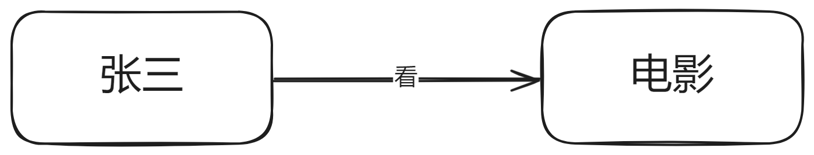
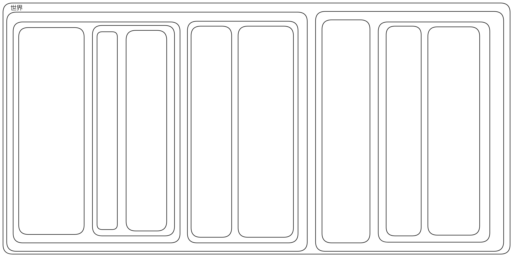
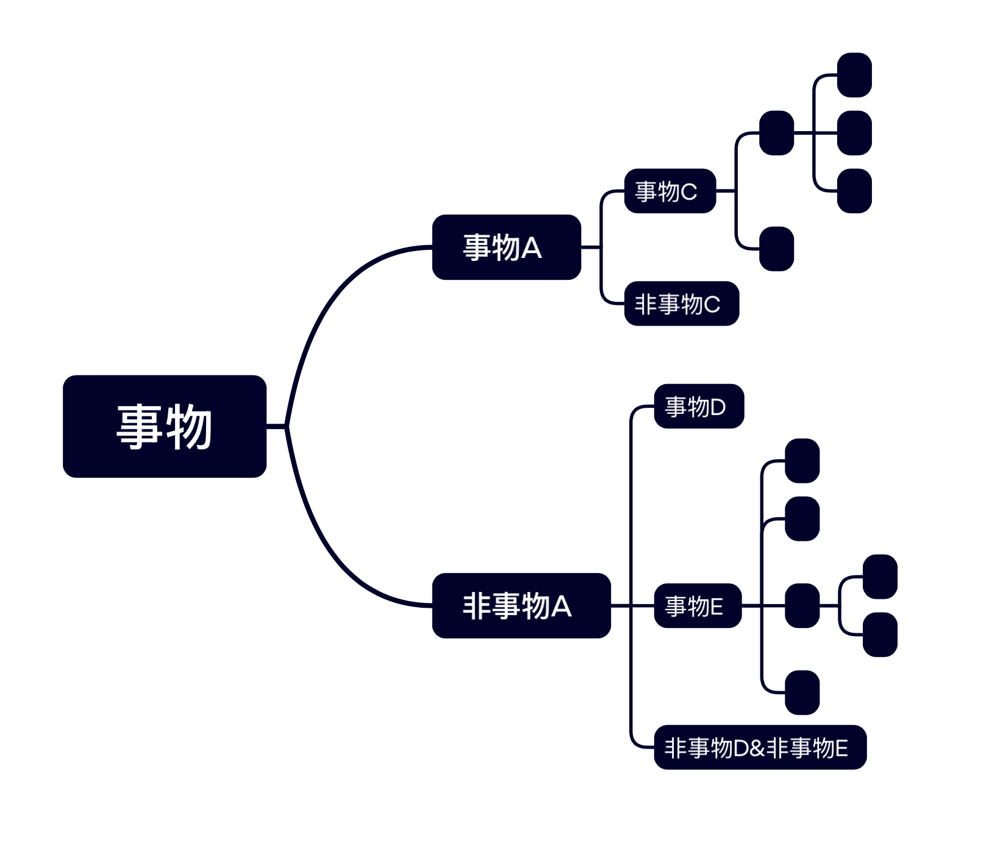
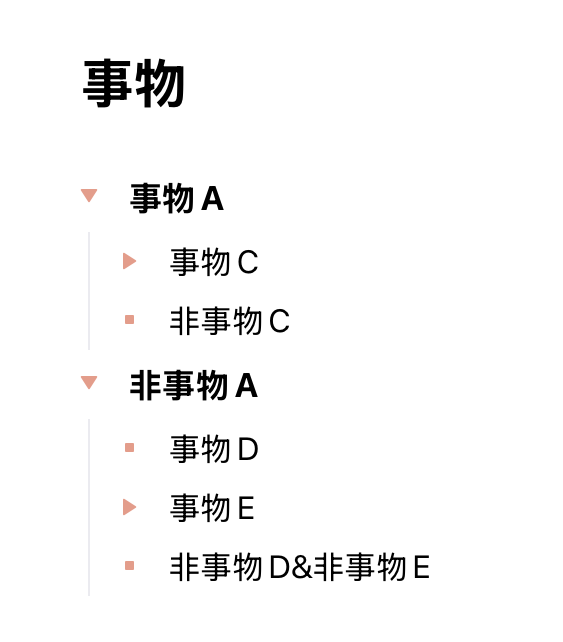

# 图形化

- 本篇有实际意义, 将教你如何正确绘制代表所有事物的`结构图`

## 最小单位

绝对的、静态的、无关的：

相对的、动态的、有关的：

更进一步：

> [!TIP]
> `事物`和`事物`间`互相贯通`、`互相转化`、`此消彼长`, 从而以动态的眼光看世界

> [!TIP]
> `事物`在一定的变化过程内保持`稳定性`、`不变化性`, 从而可以被认识到

## 事物是可以包含的

> [!TIP]
> 注意, 如果一个事物要画在另一个事物的圆圈之内, 则它必须是`包含关系`, 参考上篇文章提到的`包含关系` 

## 包含远比你想象的还广泛

## 画出主要矛盾

## 现状

- `现状`是`世界`的`状态`
- `现状`是`对`

> [!TIP]
> 这是一个示意图, 代表世界的`状态`, 实际上`嵌套`更加庞大和复杂

> [!TIP]
> 一个很启发的事实是, `计算机`的`内存条`此时的所有`比特位`的状态, 代表计算机所有模拟的`世界的现状`

> [!TIP]
> 即使是`包含`也是一种`关系`，可以为每个事物定义一个符号, 刚开始它们是未定义的, 然后开始认识`所有关系`, 即认识了世界。
> 这和`编程语言`一样，刚开始`定义多个变量`的时候,变量是`不变的`，直到`if条件语句`把它们联系起来。

## 避免交叉概念

出现`交叉概念`, 也就是`图形`中存在圆圈相交的部分的，会让：

- `结构图`无法全面表达`概念`

## 等价的树状图

可以使用树状图来绘制代表`绝对的、静态的、无关的`的`结构图`

## 等价的文章结构

`文章结构`也可以用类似方法来全面的表达事物：

