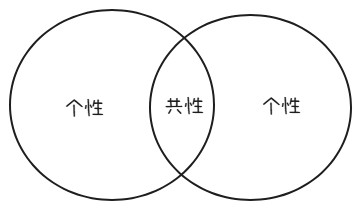

## 比较

- 比较两个事物的`共性`和`个性`

> [!IMPORTANT]
> 注意区分文恩图表达外延的重合, 还是表达内涵(功能)的重合。 内涵的重合是一种属性的外延重合。

### 分析

`集合`的`划分`，做到既全无遗漏又互斥

### 综合

- `抽象`是`在一群东西里找共性`
- `概念`的内涵`A & B`
- `概念`的外延`(A & B & C) || (A & B & D) || (A & B & E)`

> [!TIP]
> 不仅可以对具体事物进行抽象, 也可以对自然规则进行抽象，提炼出通用且必然的规律
