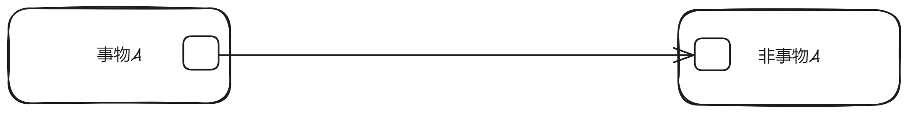
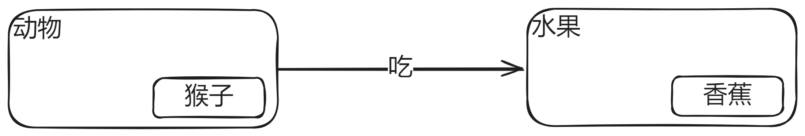

# 图形化

- 本篇有实际意义, 将教你如何正确绘制事物的`关系图`
- 实际上就是`韦恩图`, 连线是属于`关系`的

## 最小单位

绝对的（静态的）：

相对的（动态的）：

> [!TIP]
> `关系`是一个比`事物`更具体的`事物`

> [!TIP]
> `关系`是交叉概念, 但我们要避免交叉来保证关系图的全面

## 事物是可以包含的

> [!TIP]
> 注意, 如果一个事物要画在另一个事物的圆圈之内, 则它必须是`包含关系`, 参考上篇文章提到的`包含关系` 

## 包含远比你想象的还广泛

## 画出主要矛盾

## 现状

- `现状`是`世界`的`状态`

> [!TIP]
> 这是一个示意图, 代表世界的`状态`, 实际上`嵌套`更加庞大和复杂
