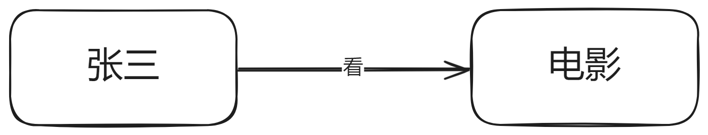
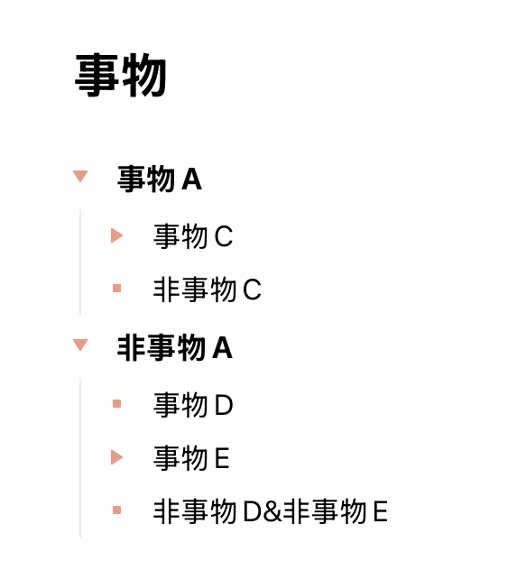

# 图形化

- 本篇有实际意义, 将教你如何正确绘制代表所有事物的`结构图`
- 实际上就是`韦恩图`的一种, 连线是属于`关系`的

## 最小单位

绝对的、静态的、无关的：

相对的、动态的、有关的：

> [!TIP]
> `关系`是一个比`事物`更具体的`事物`

> [!TIP]
> `关系`是交叉概念, 但我们要避免交叉来保证关系图的全面

## 事物是可以包含的

> [!TIP]
> 注意, 如果一个事物要画在另一个事物的圆圈之内, 则它必须是`包含关系`, 参考上篇文章提到的`包含关系` 

## 包含远比你想象的还广泛

## 画出主要矛盾

## 现状

- `现状`是`世界`的`状态`

> [!TIP]
> 这是一个示意图, 代表世界的`状态`, 实际上`嵌套`更加庞大和复杂

## 避免交叉概念

出现`交叉概念`, 也就是`图形`中存在圆圈相交的部分的，会让：

1. `结构图`无法全面表达`概念`
2. `结构图`变成不真实的

> [!TIP]
> 这和软件工程设计中要求`高内聚低耦合`是一样的, 如果不符合这点, 说明有交叉概念的存在, 而这是`不真实`的。

## 等价的树状图

可以使用树状图来绘制代表`绝对的、静态的、无关的`的`结构图`

## 等价的文章结构

`文章结构`也可以用类似方法来全面的表达事物：

