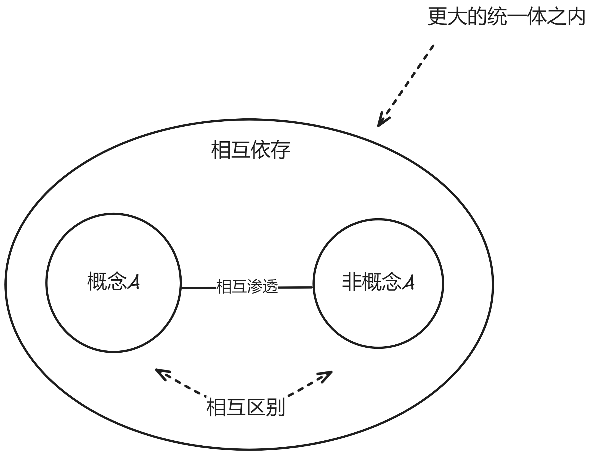

## 无限逼近

> [!IMPORTANT]
> 注意, 形而上学的问题不会有精确答案, 只能通过语言传达的意义不断逼近。
> 哲学研究的本质是思维规律, 批判性思维、辩证法、形式逻辑就是逼近理解的重要工具。

## 批判性思维

1. 延长确定结论的时间
2. 质疑思维过程和结果

## 形式逻辑

- 逻辑推理研究怎么从给定的所有前提，推出一个必然为真的结论。
- 逻辑推理可以和现实无关，单纯在研究符不符合推理规则。

## 唯物辩证法

1. `事物`是它自己的`规定性`

2. `矛盾`是最小的`规定性`

> [!TIP]
> `斗争性`事物与他物互相分离、互相对抗

> [!TIP]
> `同一性`事物与他物互相依存、互相渗透

> [!IMPORTANT]
> `斗争性`是绝对的, 无条件的。`同一性`是相对的, 有条件的。

#### 封闭与开放

- 封闭系统中，矛盾可能是此消彼长的。
- 开放系统中，矛盾不只是此消彼长，而是有可能跃升共同发展的。

#### 事物的两面性

- 事物总是有和它`逻辑相反`的那一面存在

#### 事物的主次性

- 事物的变化是有轻重的

> [!NOTE]
> `主要矛盾`是决定性的, 不是简单的`重要性`, 而是一种`必然性`

#### 事物变化的间断上升性

- 事物的变化是连续的间断上升

#### 否定即规定

1. 弃: 克服突破`落后`、`消极`部分。
2. 扬: 保留超越`先进`、`积极`部分。

> [!IMPORTANT]
> 理解：事物的发展有`目的性`（必然趋势/发展方向）

> [!IMPORTANT]
> 理解：真理藏在两个对立面之间在更高层面的综合
