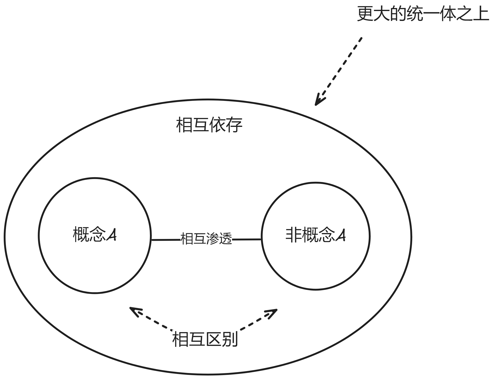

> [!IMPORTANT]
> 本篇谈及的就是最根本的规律

## 终极问题

1. `变化`和`不变`
2. `不同`和`相同`
3. `事件`和`对象`

## 终极答案

### 有效提升思维

1. 延长确定结论的时间
2. 质疑最新的结论

### 事物的必然性

- 必然的是确定的、全部的、不变的
- 因果必然：事件必然引起事件
- 事件必然：事件坚定不移的要发生

> [!NOTE]
> 信息消除了不确定性, 让事物变成确定的、必然的

### 事物之间的关系

- 一切都是事物与事物之间的关系

- 因果关系: `变化` 引起 `变化`

## 形式逻辑

1. 基本规律：`处处无矛盾`
2. 现实中所有事物恰好以`互不矛盾`的状态存在着。
3. `对`等价于`没有矛盾且理由充足`
4. `理由充足`指的是考虑到了所有矛盾点
5. `矛盾`是指：`A`不能同时`是B又不是B`
6. `逻辑推理`是指：`找到一个结论，和所有前提以及其他事物不矛盾。`

> [!TIP]
> 这里指的`矛盾`指的是`逻辑矛盾`

## 唯物辩证法

1. `事物`是它自己的`规定性`

2. `矛盾`是最小的`规定性`

> [!TIP]
> `斗争性`事物与他物互相分离、互相对抗

> [!TIP]
> `同一性`事物与他物互相依存、互相渗透

> [!IMPORTANT]
> `斗争性`是绝对的, 无条件的。`同一性`是相对的, 有条件的。

3. `事物`的`规定性`的`弱`或`强`就是事物的`普遍`或`特殊`程度

### 否定即规定

1. 弃: 克服突破`落后`、`消极`部分。
2. 扬: 保留超越`先进`、`积极`部分。

> [!IMPORTANT]
> 理解：事物的发展有`目的性`（必然趋势/发展方向）

> [!IMPORTANT]
> 理解：真理藏在两个对立面之间在更高层面的综合

### 事物变化的间断上升性

- 事物的变化是连续的间断
- 事物的变化是不断上升的

> [!NOTE]
> 质变是一种突破框架限制：事物非质变是还在原有规定性的框架下继续变化，而质变是原有规定性被突破，已经失去规定该事物的能力

### 事物的二元性

- 事物总是有和它`逻辑相反`的那一面存在

### 事物的主次性

- 事物的变化是有轻重的

> [!NOTE]
> `主要矛盾`是决定性的, 不是简单的`重要性`, 而是一种`必然性`
