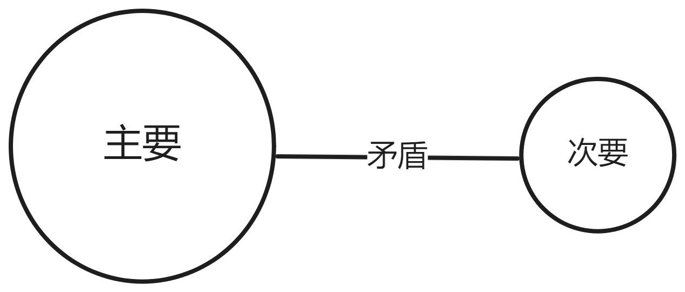

> [!IMPORTANT]
> 本篇谈及的就是最根本的规律

## 终极问题

1. `相同`和`不同`
2. `变化`和`不变`

## 形式逻辑

1. 基本规律：`处处无矛盾`
2. 现实中所有事物恰好以`互不矛盾`的状态存在着。
3. `对`等价于`没有矛盾且理由充足`
4. `理由充足`指的是考虑到了所有矛盾点
5. `矛盾`是指：`A`不能同时`是B又不是B`
6. `逻辑推理`是指：`找到一个结论，和所有前提以及其他事物不矛盾。`

> [!TIP]
> 这里指的`矛盾`指的是`逻辑矛盾`

> [!TIP]
> `形式逻辑`的观点相当于只有`斗争性`或者`同一性`, 而`辩证法`的观点则更加动态。

## 辩证法

1. `事物`是它自己的`规定`

2. `事物`与`他物`有`矛盾`

> [!TIP]
> `斗争性`事物与他物互相分离、互相否定、互相排斥

> [!TIP]
> `同一性`事物与他物互相贯通、互相渗透、互相转化

> [!IMPORTANT]
> `斗争性`是绝对的, 起主要作用的

3. `矛盾`的两个方面是`不平衡`的

4. `事物`的`规定性`的`弱`或`强`就是事物的`抽象`或`具体`程度

> [!TIP]
> `规定`就是`否定`

> [!TIP]
> 矛盾的两个对立面的`互相排斥`但又`互相渗透`, 使得`事物`之间出现了`差异`

### 通俗化 - 同一性与斗争性

1. 任意两个事物之间都有`不同点和相同点`
2. 这些`不同点和相同点`有`稳定的`和`不稳定的`
3. `稳定的不同点`可以看作`性质`
4. `不稳定的`可以看作一种`关系`
5. 科学方法论: `比较`，则是了解事物之间的`稳定的不同点和相同点`的钥匙

> [!TIP]
> `相同`则事物之间完全关联, 一样变化

> [!TIP]
> `不同`则事物之间毫无关联，独立变化

### 通俗化 - 矛盾

终极的抽象: `两个对立面的统一`

