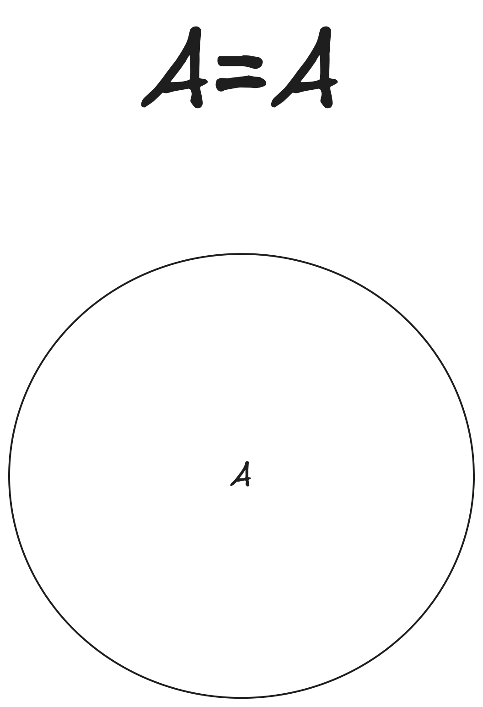
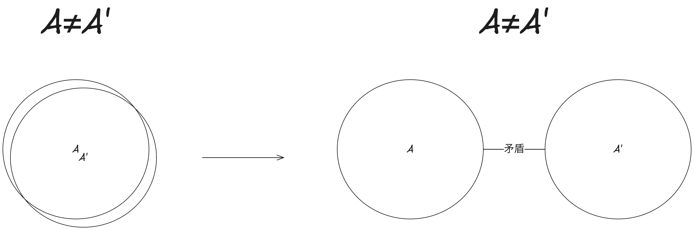
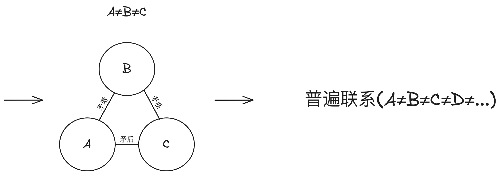
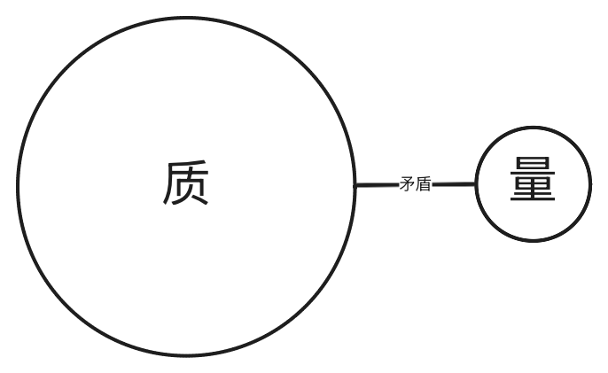

> [!IMPORTANT]
> 本篇谈及的就是最根本的规律

## 逻辑的本质

1. 基本规律：`处处无矛盾`
2. 现实中所有事物恰好以`互不矛盾`的状态存在着。
3. `对`等价于`没有矛盾且理由充足`
4. `理由充足`指的是考虑到了所有矛盾点
5. `矛盾`是指：`A`不能同时`是B又不是B`
6. `逻辑推理`是指：`找到一个结论，和所有前提以及其他事物不矛盾。`

> [!TIP]
> 这里指的`矛盾`指的是`逻辑矛盾`

> [!TIP]
> 本站观点认为， `逻辑矛盾`和`辩证矛盾`有区别但也有联系。`逻辑矛盾`无法在现实存在, 而`辩证矛盾`在现实普遍存在。

## 抽象的本质

1. `事物`是`矛盾`的统一体
2. `无规定性`是抽象的`开端`

3. `事物`与`他物`被矛盾所`区别`开, 而不`同一`

4. `事物`与`事物`之间因为`矛盾`而普遍联系

5. `矛盾`的两个方面是`不平衡`的
6. `事物`是`质`的规定性和`量`的规定性

> [!TIP]
> `规定`、`否定`为同一个意义
