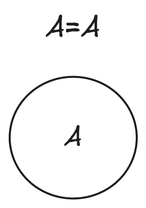
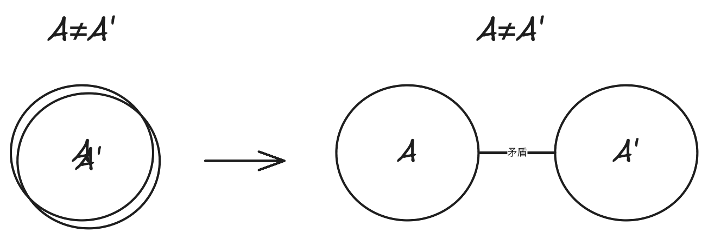

> [!IMPORTANT]
> 本篇谈及的就是最根本的规律

## 终极问题

1. `相同`与`不同`
2. `变化`与`不变`

## 形式逻辑

1. 基本规律：`处处无矛盾`
2. 现实中所有事物恰好以`互不矛盾`的状态存在着。
3. `对`等价于`没有矛盾且理由充足`
4. `理由充足`指的是考虑到了所有矛盾点
5. `矛盾`是指：`A`不能同时`是B又不是B`
6. `逻辑推理`是指：`找到一个结论，和所有前提以及其他事物不矛盾。`

> [!TIP]
> 这里指的`矛盾`指的是`逻辑矛盾`

> [!TIP]
> `形式逻辑`的观点相当于只有`斗争性`而无`统一性`, 而`唯物辩证法`的观点则更加动态。

## 辩证法

1. `事物`是它自己的`规定`

2. `无规定性`是抽象的`开端`

3. `事物`与`他物`被矛盾所`区别`开, 而不`同一`

- `斗争性`：`事物`与`他物`互相斗争、互相否定、互相排斥

- `统一性`：`事物`与`他物`互相贯通、互相渗透、互相转化

> [!TIP]
> 斗争性是绝对存在的, 是事物运动的根源, 也是事物可以被区分开的基础

5. `矛盾`的两个方面是`不平衡`的

6. `事物`的`规定性`的`弱`或`强`就是事物的`抽象`或`具体`程度

> [!TIP]
> 这里指的`矛盾`指的是`辩证矛盾`

> [!TIP]
> `规定`就是`否定`
