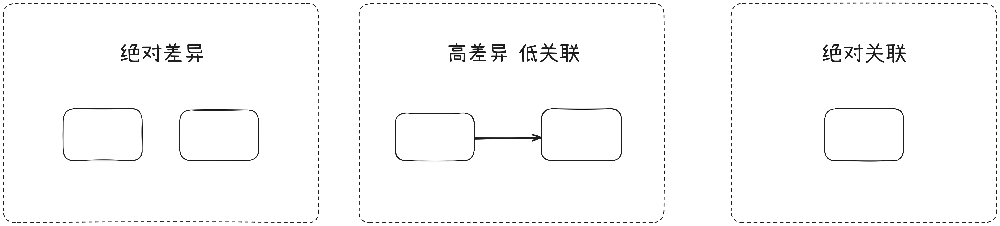

## 关键范畴

1. `变化`和`不变`
2. `不同`和`相同`
3. `事情`和`物体`

## 逻辑

### 事物的必然性

- 必然的是确定的、全部的、不变的、真的
- 信息消除了不确定性, 让事物变成确定的、必然的

> [!TIP]
> `可能性`即`不确定的`、`可变的`、`不同的`

### 事物的联系

#### 事物的性质

- 事物和事物的差异
- 事物和其他事物区分开的限制规定

#### 事物的关系

- 事物和其他事物之间的`跳跃`、`转换`、`对应`规则 
- 这种规则可以抽象为`命题`, 即命题函数: `R(a, b) = a和b有共性`

因果关系：
- 充分条件(->): `条件满足` 必然导致 `创造条件`
- 必要条件(->): `创造条件` 必须依赖 `条件满足`
- 等价关系(=): `A`和`具有性质P的A`是等价的

协同关系:
- 协同涌现(与): 系统具有各要素不具有的性质
- 协同互补(或): 多种可能的路径共存互补

> [!IMPORTANT]
> 若要达成目标，则关注必然规则以及它的条件。
