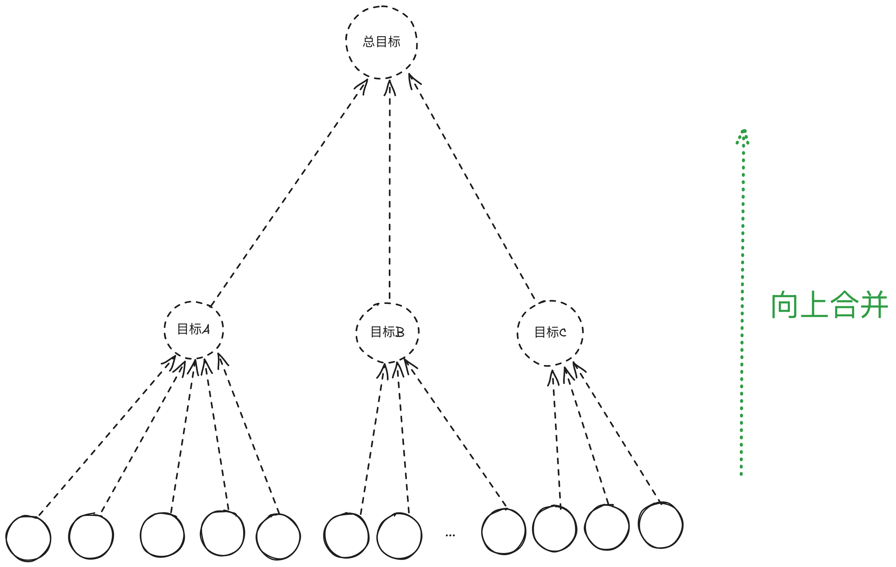

## 前置阅读

- 请先阅读：[问题的分解](./问题的分解.md)

- 本篇提到的`目标`就是`预期`

## 目标的合并

- 在`问题的分解`篇我们了解到问题可以以树的结构分解。
- 如果视角完全反过来, 从树的底层向上来看, 我们就可以`合并`目标。
- 虚线的圆圈是：试图找到底层这一堆事情, `共同的目标`是什么

 
## 化繁为简

- 如果只看最后一层，事情是杂乱无章的。
- 但经过向上合并，可以快速化繁为简。

## 软件开发的应用

- 我们直接看到的代码，通常可能是偏底部的部分。
- 试图向上找到他们的共同目标，迅速化繁为简。

