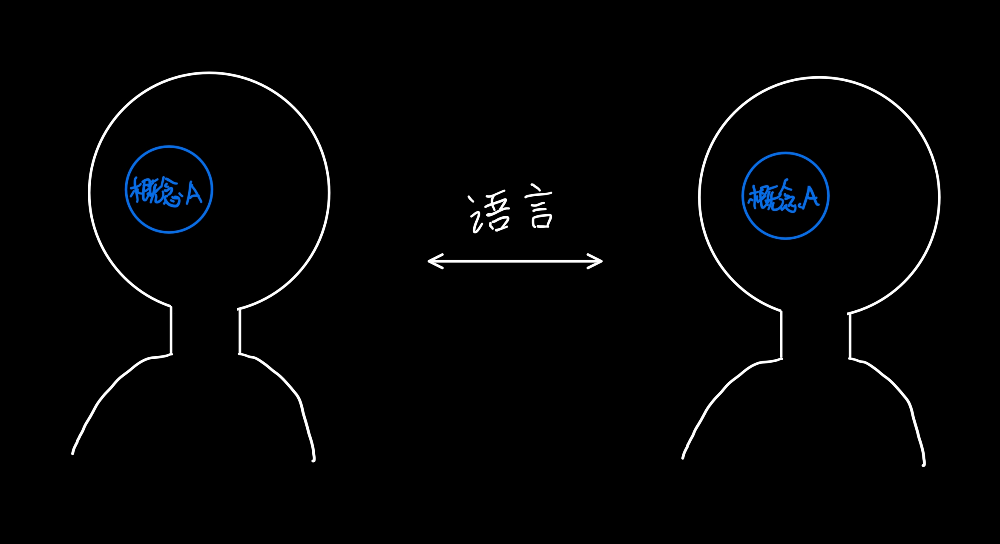

## 有效沟通: 对齐了概念

## 语言的表达作用

- `概念`对应现实中的`事物`
- `概念`是头脑中的一个`思维单位`
- `语言`让沟通双方在各自头脑中`对齐概念`

## 语言的局限性

- 语言的局限性是`注定`存在的, 不可逃避的
- 语言造成的问题只是`沟通问题`

### 不准确性

- 表达不准确造成对齐概念偏差
- 理解不准确造成对齐概念偏差

### 多义性

- 同一个词，不同`上下文`之下，可能表达不同的概念
- 不同的词，不同`上下文`之下，可能表达相同的概念

## 解决语言问题

- 先`对齐概念`，后`讨论概念间的关系`

- 认识到`语言`只是表达意义的`工具`
